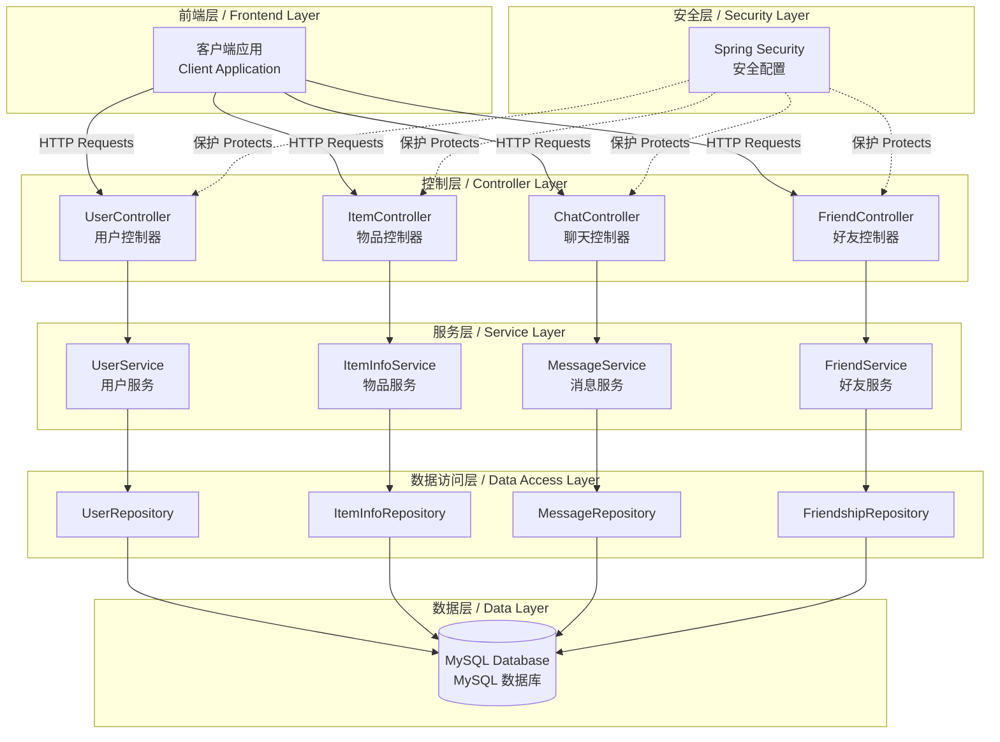
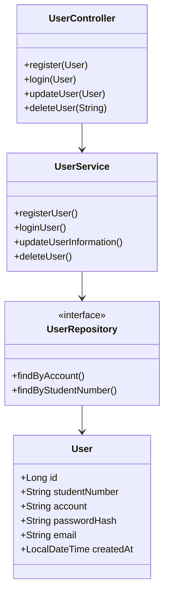
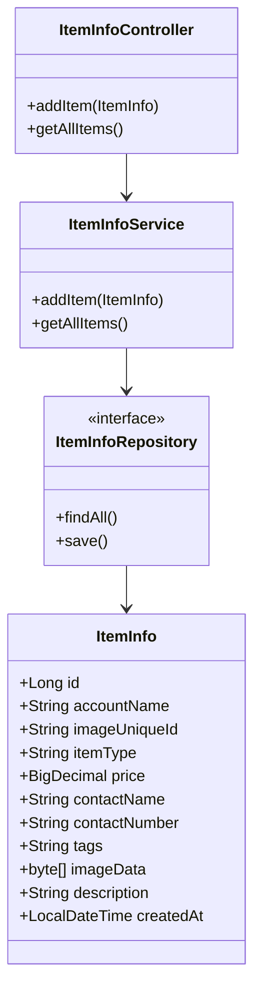
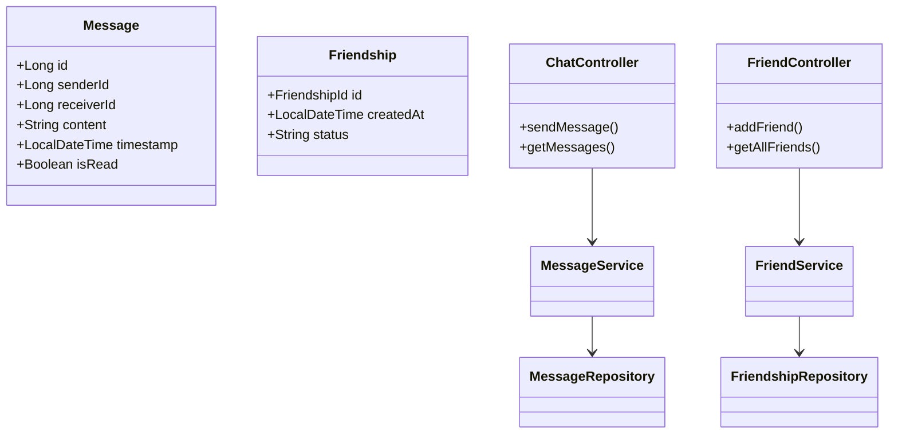
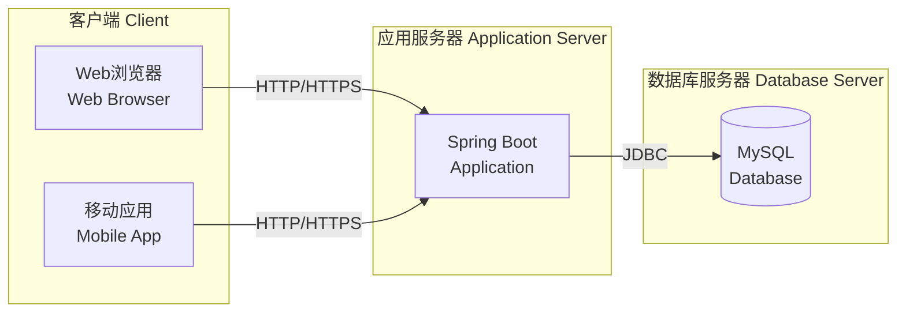

# 项目架构文档 / Project Architecture Document

## 系统架构概述 / System Architecture Overview

Campus Item Sharing Platform 采用经典的三层架构设计，基于 Spring Boot 框架构建。
Campus Item Sharing Platform adopts a classic three-tier architecture design, built on the Spring Boot framework.



## 技术栈 / Technology Stack

### 后端框架 / Backend Framework

- **Spring Boot 3.4.3**: 核心应用框架 / Core application framework
- **Spring Data JPA**: 数据持久化 / Data persistence
- **Spring Security**: 安全认证 / Security and authentication
- **Spring Web**: RESTful API 支持 / RESTful API support

### 数据库 / Database

- **MySQL 8.0**: 关系型数据库 / Relational database
- **Hibernate**: ORM 框架 / ORM framework

### 构建工具 / Build Tool

- **Maven**: 项目管理和构建 / Project management and build

## 核心模块 / Core Modules

### 1. 用户管理模块 / User Management Module



**功能 / Features:**

- 用户注册与登录 / User registration and login
- 用户信息管理 / User information management
- 密码加密存储 / Encrypted password storage

### 2. 物品共享模块 / Item Sharing Module



**功能 / Features:**

- 物品发布与管理 / Item publishing and management
- 物品信息查询 / Item information query
- 图片上传存储 / Image upload and storage
- 标签分类系统 / Tag categorization system

### 3. 聊天系统模块 / Chat System Module



**功能 / Features:**

- 用户间消息发送 / User-to-user messaging
- 好友关系管理 / Friend relationship management
- 消息历史记录 / Message history
- 消息已读状态 / Message read status

## 数据库设计 / Database Design

### 核心表结构 / Core Tables

#### users (用户表)

| 字段名 Field | 类型 Type | 说明 Description |
|-------------|----------|------------------|
| id | BIGINT | 主键 Primary Key |
| student_number | VARCHAR(50) | 学号（唯一）Student Number (Unique) |
| account | VARCHAR(50) | 账号（唯一）Account (Unique) |
| password_hash | VARCHAR(255) | 密码哈希 Password Hash |
| email | VARCHAR(100) | 邮箱 Email |
| created_at | TIMESTAMP | 创建时间 Created Time |

#### item_info (物品信息表)

| 字段名 Field | 类型 Type | 说明 Description |
|-------------|----------|------------------|
| id | BIGINT | 主键 Primary Key |
| account_name | VARCHAR(50) | 发布者账号 Publisher Account |
| image_unique_id | VARCHAR(255) | 图片ID Image ID (Unique) |
| item_type | VARCHAR(50) | 物品类型 Item Type |
| price | DECIMAL(10,2) | 价格 Price |
| contact_name | VARCHAR(50) | 联系人 Contact Name |
| contact_number | VARCHAR(20) | 联系电话 Contact Number |
| tags | VARCHAR(255) | 标签 Tags |
| image_data | BLOB | 图片数据 Image Data |
| description | TEXT | 描述 Description |
| created_at | TIMESTAMP | 创建时间 Created Time |

#### messages (消息表)

| 字段名 Field | 类型 Type | 说明 Description |
|-------------|----------|------------------|
| id | BIGINT | 主键 Primary Key |
| sender_id | BIGINT | 发送者ID Sender ID |
| receiver_id | BIGINT | 接收者ID Receiver ID |
| content | TEXT | 消息内容 Message Content |
| timestamp | TIMESTAMP | 时间戳 Timestamp |
| is_read | BOOLEAN | 是否已读 Is Read |

#### friendships (好友关系表)

| 字段名 Field | 类型 Type | 说明 Description |
|-------------|----------|------------------|
| user_id | BIGINT | 用户ID User ID |
| friend_id | BIGINT | 好友ID Friend ID |
| created_at | TIMESTAMP | 创建时间 Created Time |
| status | VARCHAR(20) | 状态 Status |

## API 设计原则 / API Design Principles

### RESTful 设计 / RESTful Design

- 使用标准 HTTP 方法：GET、POST、PUT、DELETE
- Use standard HTTP methods: GET, POST, PUT, DELETE
- 资源导向的 URL 设计
- Resource-oriented URL design
- 统一的响应格式
- Unified response format

### 响应格式 / Response Format

```json
{
  "status": "success" | "error",
  "message": "描述信息 / Description message",
  "data": { }
}
```

## 安全设计 / Security Design

### Spring Security 配置

1. **密码加密 / Password Encryption**: 使用 BCrypt 算法
2. **跨域配置 / CORS Configuration**: 配置允许的来源
3. **认证授权 /Authentication & Authorization**: 基于角色的访问控制

### 数据保护 / Data Protection

- 密码不以明文存储 / Passwords not stored in plain text
- 敏感配置使用环境变量 / Sensitive configs use environment variables
- SQL 注入防护（JPA 自动处理）/ SQL injection prevention (JPA auto-handled)

## 部署架构 / Deployment Architecture



## 扩展性设计 / Scalability Design

### 当前支持 / Current Support

- 单机部署 / Single server deployment
- 基础负载 / Basic load
- 本地存储 / Local storage

### 未来扩展 / Future Extensions

- 分布式部署 / Distributed deployment
- 缓存层（Redis）/ Caching layer (Redis)
- 消息队列（RabbitMQ/Kafka）/ Message queue (RabbitMQ/Kafka)
- 对象存储（图片）/ Object storage (images)
- 微服务架构 / Microservices architecture

## 性能优化 / Performance Optimization

### 已实现 / Implemented

- JPA 懒加载 / JPA lazy loading
- 数据库索引 / Database indexes
- 连接池管理 / Connection pool management

### 可优化项 / Optimizable Items

- 添加 Redis 缓存 / Add Redis caching
- 数据库读写分离 / Database read-write separation
- CDN 加速图片访问 / CDN for image acceleration
- API 响应压缩 / API response compression

## 监控与日志 / Monitoring and Logging

### 日志框架 / Logging Framework

- SLF4J + Logback (Spring Boot 默认 / default)
- 分级日志记录 / Hierarchical logging
- 异常堆栈追踪 / Exception stack tracing

### 监控指标 / Monitoring Metrics

- 应用健康检查 / Application health check
- 数据库连接监控 / Database connection monitoring
- API 响应时间 / API response time

---

## 开发规范 / Development Standards

### 代码规范 / Code Standards

- 遵循 Java 命名约定 / Follow Java naming conventions
- 所有公共方法添加 Javadoc / Add Javadoc for all public methods
- 中英双语注释 / Bilingual comments (Chinese/English)

### Git 提交规范 / Git Commit Standards

- feat: 新功能 / New feature
- fix: 修复bug / Bug fix
- docs: 文档更新 / Documentation update
- refactor: 代码重构 / Code refactoring
- test: 测试相关 / Test related

---

<div align="center">

**文档版本 / Document Version:** 1.0  
**最后更新 / Last Updated:** 2025-12-30  
**作者 / Author:** psmarter

</div>
