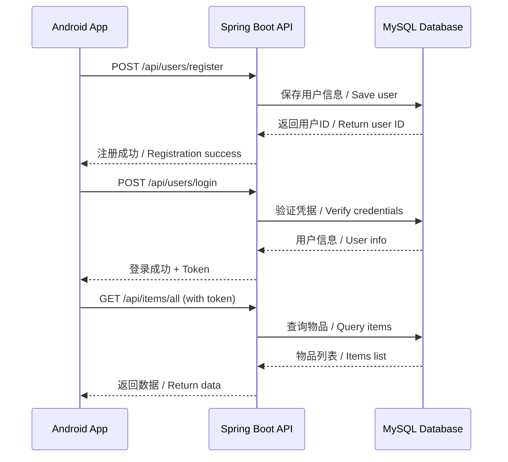

# 移动端对接指南 / Mobile App Integration Guide

## 📱 前端应用仓库 / Frontend Application Repository

**Android 应用仓库**: [CampusShare-AI](https://github.com/psmarter/CampusShare-AI)

该 Android 应用集成了 Google Gemini AI，提供智能物品推荐、自动分类和描述生成等功能。  
The Android app integrates Google Gemini AI, providing smart item recommendations, auto-categorization, and description generation.

---

## 🌐 API 配置指南 / API Configuration Guide

### 开发环境 / Development Environment

#### 本地开发服务器 / Local Development Server

后端服务默认运行在以下地址：  
Backend service runs at:

```
http://localhost:8080
```

#### Android 模拟器配置 / Android Emulator Configuration

Android 模拟器需要使用特殊的 IP 地址来访问主机：  
Android emulator needs special IP address to access host machine:

```
后端地址 / Backend URL: http://10.0.2.2:8080
```

> **原理说明 / Explanation**:  
> `10.0.2.2` 是 Android 模拟器中指向主机的特殊 IP 地址  
> `10.0.2.2` is a special alias to the host loopback interface in Android emulator

#### 真机调试 / Physical Device Testing

使用真机调试时，需要以下配置：  
When testing on a physical device:

1. **确保设备和电脑在同一 WiFi 网络 / Ensure device and computer are on the same WiFi**

2. **查找电脑的局域网 IP / Find your computer's local IP**:

   ```bash
   # Windows
   ipconfig
   # 查找 IPv4 地址，例如: 192.168.1.100
   
   # macOS/Linux
   ifconfig
   # 或 / or
   ip addr show
   ```

3. **配置后端监听所有接口 / Configure backend to listen on all interfaces**:

   在 `application.properties` 中设置：  
   Set in `application.properties`:

   ```properties
   server.address=0.0.0.0
   server.port=8080
   ```

4. **在前端配置 IP 地址 / Configure IP in frontend**:

   ```
   后端地址 / Backend URL: http://192.168.1.100:8080
   (替换为你的实际 IP / Replace with your actual IP)
   ```

5. **防火墙配置 / Firewall Configuration**:
   确保防火墙允许 8080 端口的入站连接  
   Ensure firewall allows inbound connections on port 8080

---

### 生产环境 / Production Environment

#### 推荐部署平台 / Recommended Deployment Platforms

| 平台 Platform | 特点 Features | 价格 Pricing |
|--------------|--------------|-------------|
| **Render** | 易用，自动部署 / Easy to use, auto-deploy | 免费tier / Free tier |
| **Railway** | 快速部署 / Quick deployment | 免费额度 / Free credits |
| **Heroku** | 成熟稳定 / Mature and stable | 免费plan / Free plan |
| **阿里云 ECS** | 国内访问快 / Fast in China | 按量付费 / Pay-as-you-go |
| **AWS EC2** | 强大灵活 / Powerful and flexible | 免费tier / Free tier |

#### 部署步骤 / Deployment Steps

1. **选择部署平台并部署后端 / Choose platform and deploy backend**

2. **配置 HTTPS / Configure HTTPS**:
   - 大多数平台自动提供 SSL 证书 / Most platforms provide SSL automatically
   - 如需自定义域名，配置 DNS / For custom domain, configure DNS

3. **获取生产环境 URL / Get production URL**:

   ```
   例如 / Example: https://campus-share-api.onrender.com
   ```

4. **更新前端配置 / Update frontend configuration**:
   在 Android 项目的 `ApiConfig.kt` 中更新：  
   Update in Android project's `ApiConfig.kt`:

   ```kotlin
   val BASE_URL = "https://campus-share-api.onrender.com"
   ```

5. **测试生产环境 API / Test production API**:

   ```bash
   curl https://campus-share-api.onrender.com/api/items/all
   ```

---

## 🔐 安全与认证 / Security and Authentication

### CORS 配置 / CORS Configuration

✅ 后端已配置 CORS，允许移动应用访问所有 API 端点  
✅ Backend has CORS configured to allow mobile app access to all API endpoints

查看配置文件：`src/main/java/com/example/campusitemsharing/config/CorsConfig.java`  
See configuration: `src/main/java/com/example/campusitemsharing/config/CorsConfig.java`

### 认证流程 / Authentication Flow



### API 认证步骤 / API Authentication Steps

1. **用户注册 / User Registration**

   ```
   POST /api/users/register
   ```

2. **用户登录 / User Login**

   ```
   POST /api/users/login
   ```

3. **获取 Token（如需要）/ Get Token (if needed)**
   - 后端返回认证令牌 / Backend returns auth token
   - 保存在本地存储 / Save in local storage

4. **携带认证信息访问 API / Access API with authentication**
   - 在请求头中添加 token / Add token in request headers
   - 例如 / Example: `Authorization: Bearer <token>`

---

## 📝 API 端点对接 / API Endpoints Integration

### 完整 API 文档 / Complete API Documentation

查看完整的 API 文档：[API.md](../API.md)  
See complete API documentation: [API.md](../API.md)

### 快速参考 / Quick Reference

#### 用户管理 / User Management

| 端点 Endpoint | 方法 Method | 说明 Description |
|--------------|-------------|-----------------|
| `/api/users/register` | POST | 用户注册 / User registration |
| `/api/users/login` | POST | 用户登录 / User login |
| `/api/users/update` | PUT | 更新用户信息 / Update user info |
| `/api/users/delete/{account}` | DELETE | 删除用户 / Delete user |

#### 物品管理 / Item Management

| 端点 Endpoint | 方法 Method | 说明 Description |
|--------------|-------------|-----------------|
| `/api/items/add` | POST | 发布物品 / Publish item |
| `/api/items/all` | GET | 获取所有物品 / Get all items |

#### 社交功能 / Social Features

| 端点 Endpoint | 方法 Method | 说明 Description |
|--------------|-------------|-----------------|
| `/api/friends/add` | POST | 添加好友 / Add friend |
| `/api/friends/all` | GET | 获取好友列表 / Get friends |
| `/api/chat/send` | POST | 发送消息 / Send message |
| `/api/chat/messages` | GET | 获取消息 / Get messages |

---

## 🧪 API 测试 / API Testing

### 使用 Postman 测试 / Testing with Postman

1. **导入 API 集合 / Import API collection**
2. **设置环境变量 / Set environment variables**:
   - `base_url`: `http://localhost:8080` 或生产地址 / or production URL
3. **测试各个端点 / Test each endpoint**
4. **验证响应格式 / Verify response format**

### 使用 cURL 测试 / Testing with cURL

#### 用户注册 / User Registration

```bash
curl -X POST http://localhost:8080/api/users/register \
  -H "Content-Type: application/json" \
  -d '{
    "studentNumber": "2024001",
    "account": "test_user",
    "passwordHash": "password123",
    "email": "test@campus.edu"
  }'
```

#### 获取所有物品 / Get All Items

```bash
curl http://localhost:8080/api/items/all
```

#### 发布物品 / Publish Item

```bash
curl -X POST http://localhost:8080/api/items/add \
  -H "Content-Type: application/json" \
  -d '{
    "accountName": "test_user",
    "imageUniqueId": "img_001",
    "itemType": "Books",
    "price": 25.00,
    "contactName": "John Doe",
    "contactNumber": "1234567890",
    "tags": "textbook,mathematics",
    "description": "Advanced Mathematics Textbook",
    "imageData": "<base64_encoded_image>"
  }'
```

---

## 📊 数据格式 / Data Format

### 请求格式 / Request Format

所有请求使用 JSON 格式：  
All requests use JSON format:

```json
{
  "field1": "value1",
  "field2": "value2"
}
```

### 响应格式 / Response Format

标准响应格式：  
Standard response format:

```json
{
  "status": "success" | "error",
  "message": "操作结果描述 / Operation result description",
  "data": {
    // 返回的数据对象 / Returned data object
  }
}
```

### 图片处理 / Image Handling

图片数据使用 Base64 编码：  
Images are Base64 encoded:

1. **Android 端编码 / Android encoding**:

   ```kotlin
   val base64Image = android.util.Base64.encodeToString(
       imageBytes, 
       android.util.Base64.DEFAULT
   )
   ```

2. **发送到后端 / Send to backend**:

   ```json
   {
     "imageData": "data:image/jpeg;base64,/9j/4AAQSkZJRg..."
   }
   ```

3. **后端存储 / Backend storage**:
   - 存储在 MySQL BLOB 字段 / Stored in MySQL BLOB field
   - 返回时重新编码 / Re-encoded when returned

---

## 🚀 部署检查清单 / Deployment Checklist

### 后端部署 / Backend Deployment

- [ ] ✅ 后端服务正常运行 / Backend service running
- [ ] ✅ MySQL 数据库连接成功 / MySQL database connected
- [ ] ✅ CORS 配置正确 / CORS configured correctly
- [ ] ✅ 所有 API 端点可访问 / All API endpoints accessible
- [ ] ✅ 日志记录正常 / Logging working properly
- [ ] ✅ 错误处理完善 / Error handling complete

### 前端配置 / Frontend Configuration

- [ ] 📱 配置正确的 API 地址 / Configure correct API URL
- [ ] 📱 网络权限已添加 / Network permissions added (AndroidManifest.xml)
- [ ] 📱 HTTP 明文流量允许（开发环境）/ Allow cleartext traffic (development)
- [ ] 📱 HTTPS 证书配置（生产环境）/ HTTPS certificate configured (production)
- [ ] 📱 API 连接测试通过 / API connection test passed

### 生产环境额外要求 / Production Additional Requirements

- [ ] 🔒 启用 HTTPS / Enable HTTPS
- [ ] 🔒 配置 SSL 证书 / Configure SSL certificate
- [ ] 🔒 更新 CORS 为特定域名 / Update CORS to specific domains
- [ ] 🔒 配置环境变量 / Configure environment variables
- [ ] 🔒 数据库备份策略 / Database backup strategy
- [ ] 🔒 监控和日志系统 / Monitoring and logging system

---

## 🔧 故障排查 / Troubleshooting

### 常见问题 / Common Issues

#### 1. 连接被拒绝 / Connection Refused

**症状 / Symptom**: `Connection refused` 或 `Unable to connect`

**解决方案 / Solution**:

- 检查后端是否运行 / Check if backend is running
- 验证 IP 地址和端口 / Verify IP address and port
- 检查防火墙设置 / Check firewall settings
- Android 模拟器使用 `10.0.2.2` / Use `10.0.2.2` for emulator

#### 2. CORS 错误 / CORS Errors

**症状 / Symptom**: `CORS policy: No 'Access-Control-Allow-Origin' header`

**解决方案 / Solution**:

- 确认 `CorsConfig.java` 已正确配置 / Verify `CorsConfig.java` is configured
- 重启后端服务 / Restart backend service
- 检查 SecurityConfig 是否启用 CORS / Check if CORS is enabled in SecurityConfig

#### 3. 认证失败 / Authentication Failed

**症状 / Symptom**: `401 Unauthorized`

**解决方案 / Solution**:

- 检查用户凭据 / Verify user credentials
- 确认 token 正确传递 / Ensure token is correctly passed
- 检查 SecurityConfig 配置 / Check SecurityConfig settings

#### 4. 图片上传失败 / Image Upload Failed

**症状 / Symptom**: `400 Bad Request` 或图片显示异常

**解决方案 / Solution**:

- 检查 Base64 编码是否正确 / Verify Base64 encoding
- 确认图片大小限制 / Check image size limits
- 检查数据库 BLOB 字段配置 / Verify database BLOB field configuration

---

## 📞 获取帮助 / Get Help

### 文档资源 / Documentation Resources

- 📚 [完整 API 文档](../API.md) / [Complete API Documentation](../API.md)
- 🏗️ [架构文档](../ARCHITECTURE.md) / [Architecture Documentation](../ARCHITECTURE.md)
- 🤝 [贡献指南](../CONTRIBUTING.md) / [Contributing Guide](../CONTRIBUTING.md)

### 联系方式 / Contact

- 💬 GitHub Issues: [提交问题](https://github.com/psmarter/Campus_Spring_boot/issues)
- 📧 Email: 通过 GitHub 联系作者 / Contact author via GitHub

---

<div align="center">

**🎓 祝你开发顺利！/ Happy Coding!**

**如有问题，欢迎提 Issue！/ Feel free to open an issue if you have questions!**

</div>
